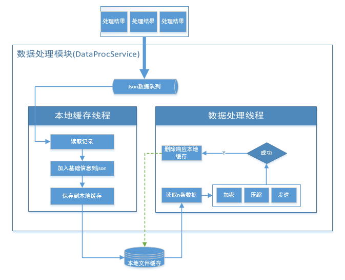

# 设计文稿


### web  后台

//TODO

## 任务管理器

### 主要功能

* 接收web后台发送过来的（CRUD）JOB命令
* 接收web后台 获取JOB状态以及节点状态信息
* 维护JOB列表信息
* 将JOB转化成任务列表
* 维护节点列表信息

> 每个JOB 可能需要不同的任务处理节点处理 管理器将JOB 拆分成Task 发送至对应需要处理的节点

### KV存储转换

> JOB和NODE是多对多关系

* Create_Job操作

```bash
# -----------------batch-------------------
# 第一步 创建 job kv对 插入数据库
key = "job" + id 
value = task.dump() #序列化
# 第二步 创建 node 和 job reserve关联 kv 对
key = "reserve" + node_id + "job" + job_id
# -----------------batch-------------------
```
* Update_Job操作

```bash
# -----------------batch-------------------

# 第一步 尝试删除 job kv对 插入数据库
key = "job" + id 
# 第二步 尝试删除原有关联
key = "reserve" + node_id + "job" + job_id
key = "regular" + node_id + "job" + job_id
# 第三步 重新 job kv对 插入数据库
key = "job" + id 
value = task.dump() #序列化
# 第四步 创建 node 和 job reserve关联 kv 对
key = "reserve" + node_id + "job" + job_id

# -----------------batch-------------------

# 简化

# -----------------batch-------------------

# 第一步 重新 job kv对 插入数据库
key = "job" + id
value = task.dump() #序列化
# 第二步 尝试删除原有关联
key = "regular" + node_id + "job" + job_id
# 第三步 创建 node 和 job reserve关联 kv 对
key = "reserve" + node_id + "job" + job_id

# -----------------batch-------------------


```

* Delete_Job操作

```bash

# -----------------batch-------------------

# 第一步 尝试删除 job kv对 插入数据库
key = "job" + id 
# 第二步 尝试删除原有关联
key = "reserve" + node_id + "job" + job_id
key = "regular" + node_id + "job" + job_id

# -----------------batch-------------------

```

* Get_Fresh_Task_List操作

```bash
# -----------------batch-------------------
# 第一步 扫描所有关联的job_id
startkey = "reserve" + node_id + "job" + job_id
key = "reserve" + node_id + "job" + job_id

# 第二步 扫描所有关联的的task
key = "job" + id 
value = task.dump() #序列化
# -----------------batch-------------------
```

* Get_Whole_Task_List操作

```bash
# -----------------batch-------------------
# 第一步 扫描所有关联的job_id
key = "reserve" + node_id + "job" + job_id
key = "regular" + node_id + "job" + job_id
value = task.dump() #序列化
# 第二步 扫描所有关联的的task
key = "node" + node_id + 
# -----------------batch-------------------
```

* List_Job_status操作


* List_Node_status操作

## 任务处理节点

* 从任务管理器中获取属于自己的任务
* 按照任务的执行周期执行具体任务
* 将任务结果压缩发出
* 维护Task列表
* 报告自身状态

### Grpc连接模块

### 任务处理模块

### 数据预处理模块



## 数据接收单元

* 接收从任务节点返回来的数据
* 存储数据至数据库
